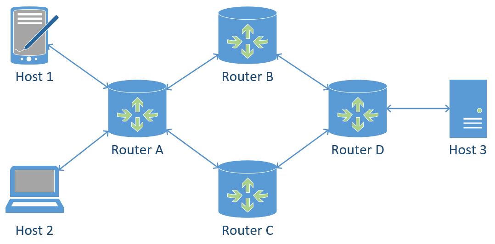

# CSCI 466 Programming Assignment - Control Plane 

## Instructions
### Due: 11/20/17 11:59PM


Complete the following assignment in pairs, or groups of three. Submit your work into the Dropbox on D2L into the “Programming Assignment 4” folder. All partners will submit the same solution and we will only grade one solution for each group.

## Learning Objectives

In this lab you will:

-   Design a control packet

-   Implement a distance-vector routing protocol

-   Control routing using link costs

## Overview

During this project, you will implement a distance-vector routing protocol on a router. 
Your task is to extend the given code to implement several router functions.

### Starting Code

The starting code for this project (`prog4.zip` in the D2L content area) provides you with the implementation several network layers that cooperate to provide end-to-end communication.

```
    NETWORK LAYER (network.py)
    DATA LINK LAYER (link.py)
```

The code also includes `simulation.py` that manages the threads running the different network objects.
Currently, `simulation.py` defines the following network.


At a high level a network defined in `simulation.py` includes hosts, routers and links. 
`Hosts` generate and receive traffic. 
`Routers` forward traffic from one `Interface` to another based on routing tables that you will implement. 
`Links` connect network interfaces of routers and hosts. 
Finally, the `LinkLayer` forwards traffic along links. 

### Program Invocation

To run the starting code you may execute:

```
    python simulation.py
```

The current `simulation_time` in `simulation.py` is one second. As the network becomes more complex and takes longer to execute, you may need to extend the simulation to allow all the packets to be transfered.

## Assignment

1. [2 points] Currently `Router.print_routes()` just prints the dictionary used to
store routing tables. Print out a ‘pretty’ table view of the routing
table, for example:

	```
           Cost to
           u v x y z
         1 ~ ~ ~ ~ ~
    From 2 ~ ~ ~ ~ ~
         3 ~ 6 2 ~ 0
 	```  

	This will also be very useful to you in debugging your protocol.

	Submit a YouTube video link showing your output without modifying `simulation.py`.

2. [10 points] Currently `Router.send_routes()` does not send route updates correctly. Modify that function to send out route updates as defined in the distance-vector protocol discussed in class and your textbook. You will need to come up with a message that encodes the state of your routing tables. My advise would be to come up with a message class that has a `to_byte_S()` `from_byte_S()` functions.

	Currently `Router.update_routes()` does not update routes correctly. Modify that function to update the routing tables (using Bellman-Ford) based on updates from `Router.send_routes()`. Be aware that receiving an update may mean that you will need to send an update as well!

	Submit a YouTube video link showing your output without modifying `simulation.py`.

3. [5 points] Modify `simulation.py` to have `Host 2` send a reply packet on the
reverse route.

	Submit a YouTube video link showing showing your output from `simulation.py`. Also submit your code for this scenario as `link_1.py`, `network_1.py`, and `simulation_1.py`.

4. [13 points] The current router implementation supports a very simple topology.

	Configure `simulation.py` to reflect the following network topology.

	

	Now change the link costs in that network such that packets from `Host 1` to `Host 3` follow a different path than packets from `Host 3` to `Host 1.`

	Submit a YouTube video link showing your output from `simulation.py`. Also submit your code for this scenario as `link_2.py`, `network_2.py`, and `simulation_2.py`.

5. [1 point] BONUS: Extend the code to support IP addressing both for the hosts and router interfaces. You will need to modify the output so that we can see addresses on both the hosts and the router interfaces as they forward the packets.

	Submit a YouTube video link showing your output from `simulation.py`.
	Submit `link_3.py`, `network_3.py`, and `simulation_3.py`.

6. [1 point] BONUS: Implement IP multicast among a group of three hosts

	Submit a YouTube video link showing your output from `simulation.py`. Submit `link_4.py`, `network_4.py`, and `simulation_4.py`.
